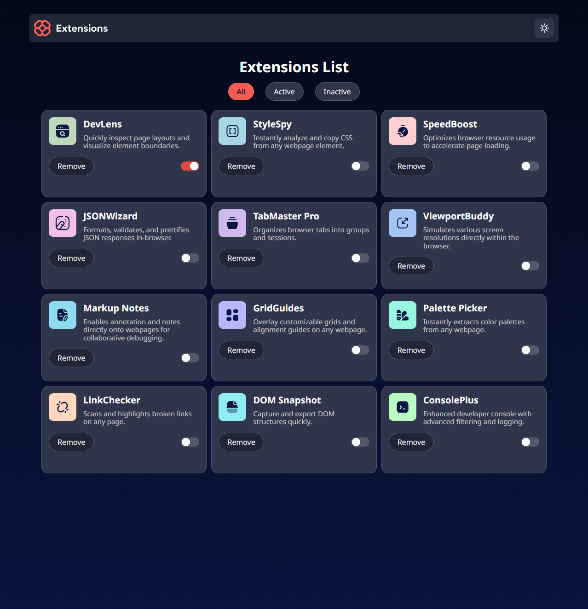
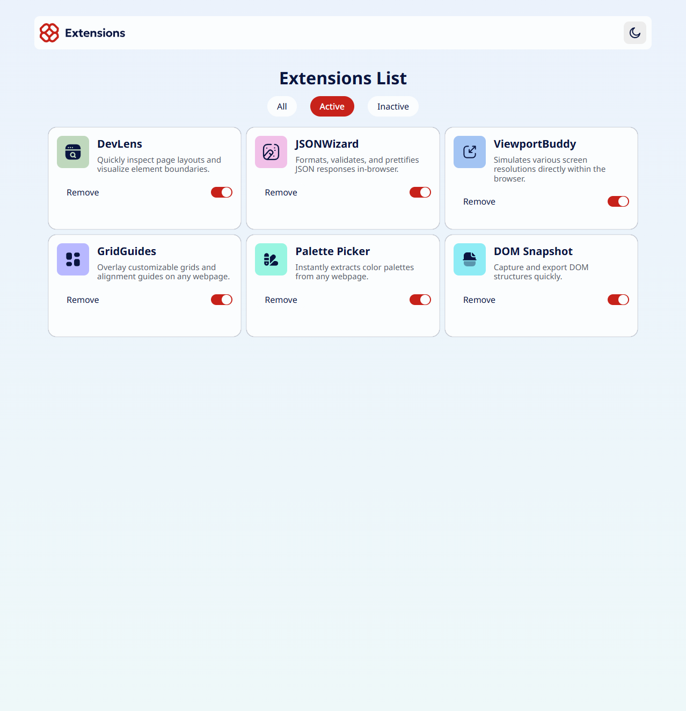

# **Frontend Mentor \- Browser extensions manager UI solution**

This is a solution to the [Browser extensions manager UI challenge on Frontend Mentor](https://www.frontendmentor.io/challenges/browser-extension-manager-ui-yNZnOfsMAp). Frontend Mentor challenges help you improve your coding skills by building realistic projects.

## Table of contents

- [Overview](#overview)
  - [The challenge](#the-challenge)
  - [Screenshot](#screenshot)
  - [Links](#links)
- [My process](#my-process)
  - [Built with](#built-with)
  - [What I learned](#what-i-learned)
  - [Continued development](#continued-development)
  - [Useful resources](#useful-resources)
- [Author](#author)

## **Overview**

### **The challenge**

Users should be able to:

- Toggle extensions between active and inactive states
- Filter active and inactive extensions
- Remove extensions from the list
- Select their color theme (Dark/Light mode)
- View the optimal layout for the interface depending on their device's screen size
- See hover and focus states for all interactive elements on the page

### **Screenshot**

#### Dark Mode



#### Light Mode



### **Links**

- Live Site URL: [Live link](https://joudn2001.github.io/Browser-extension-manager-UI/)
- GitHub repository for the code

```bash
git clone https://github.com/JoudN2001/Browser-extension-manager-UI.git
```

## **My process**

### **Built with**

- Semantic HTML5 markup
- CSS Custom Properties (Variables)
- Flexbox & CSS Grid
- Mobile-first workflow
- Vanilla JavaScript (DOM manipulation)
- [Noto Sans](https://fonts.google.com/noto/specimen/Noto+Sans) \- Google Fonts

### **What I learned**

This project was a great opportunity to practice DOM manipulation and state management without using a framework.

One major learning point was implementing the **Dark/Light mode toggle**. I learned how to swap icons and update CSS variables (or classes) on the root element to instantly switch themes.

```
// Example of how I handled the theme toggle
const themeToggle \= document.getElementById('colorSchema');
themeToggle.addEventListener('click', () \=\> {
  document.body.classList.toggle('dark-mode');
  // Logic to switch the sun/moon icon source
});
```

I also improved my skills in **filtering data**. Creating the "All", "Active", and "Inactive" tabs required selecting elements based on their state and dynamically hiding or showing them.

```
/\* CSS used for the card layout \*/
.card {
  display: flex;
  justify-content: space-between;
  align-items: center;
  transition: all 0.3s ease;
}
```

### **Continued development**

In the future, I would like to refactor this project to use a JavaScript framework like **React** or **Vue**. This would make state management (like the list of extensions and their active status) much easier to handle than direct DOM manipulation.

I also plan to improve the accessibility of the toggle switches to ensure they are fully navigable via keyboard.

### **Useful resources**

- [W3Schools \- How TO \- Toggle Switch](https://www.w3schools.com/howto/howto_css_switch.asp) \- Used to understand how to create a custom toggle switch using CSS.
- [\[Arabic\] HTML & CSS Template Four 2022 \#20 \- Settings Page \- Toggle Switch](https://youtu.be/wBymjmOEK8Q) \- A helpful video tutorial on building a settings page and toggle switch.
- [MDN Web Docs \- Element.closest()](https://developer.mozilla.org/en-US/docs/Web/API/Element/closest) \- Helped in traversing the DOM tree to find specific parent elements.
- [W3Schools \- How TO \- Toggle Class](https://www.w3schools.com/howto/howto_js_toggle_class.asp) \- Guide on how to toggle classes for interactive states.
- [MDN Web Docs \- Document.styleSheets](https://developer.mozilla.org/en-US/docs/Web/API/Document/styleSheets) \- Reference for accessing and manipulating stylesheets directly.
- [Learn JavaScript In Arabic 2021 \- \#096 \- CSS Styling And Stylesheets](https://www.youtube.com/watch?v=GELiBxWNdmo) \- Detailed explanation of CSS styling manipulation via JavaScript.
- [freeCodeCamp \- Best Practices for Responsive Web Design](https://www.freecodecamp.org/learn/responsive-web-design-v9/lecture-best-practices-for-responsive-web-design/how-do-media-queries-work) \- Refresher on how media queries work for responsive layouts.

## **Author**

- Github \- [JoudN2001](https://github.com/JoudN2001)
- Linkedin \- [Joud Kayyali](https://www.linkedin.com/in/joudn2001/)
- Twitter \- [@JoudN2001](https://x.com/JoudN2001)
